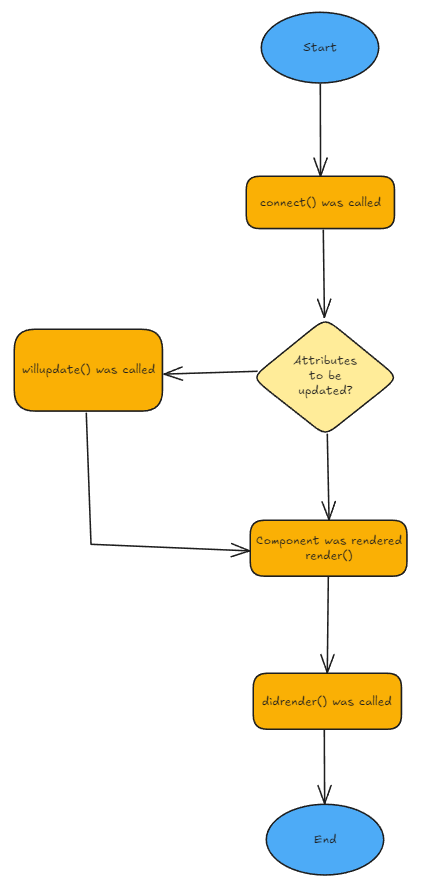

# LivixJS

**LivixJS** is a lightweight Web Component base framework that provides lifecycle management, automatic rendering, and attribute-driven reactivity with zero dependencies.

---

## 🚀 Features

- ✅ **Standard Web Component base** using `HTMLElement`
- 🔁 **Reactive attributes** with auto-update via `attributeChangedCallback`
- ⚙️ **Lifecycle hooks**: `connect()`, `disconnect()`, `willupdate()`, `didrender()`
- 💡 **Mixin architecture** for composable behavior
- 🎯 **Auto-rendering** via `render()` and shadow DOM injection
- 🧩 Easy to use: just `extends LivixElement`

---

## 📦 Installation

You can clone or copy the library manually:

```bash
git clone https://github.com/your-username/livix.git
```
---

## 🔄 Livix Lifecycle



---

## 📄 Usage Example

```js
// my-component.js
import { LivixElement } from './livix-core.js';

class MyComponent extends LivixElement {
  static attrs = ['title'];

  constructor() {
    super();
    this.flag = 0;
    this.template = [
      `<p id="msg">Hello Web Component</p>`,
      `<p id="msg">Title Updated!</p>`
    ];
  }

  connect() {
    // Initialize attribute if not provided
    if (!this.hasAttribute('title')) {
      this.setAttribute('title', 'Hello');
    }
  }

  render() {
    return this.template[this.flag];
  }

  didrender() {
    this.shadowRoot.querySelector('#msg')?.addEventListener('click', () => {
      this.setAttribute('title', 'Clicked!');
    });
  }

  willupdate(name, oldValue, newValue) {
    if (name === 'title' && oldValue) {
      this.flag = 1;
    }
  }
}
customElements.define('my-component', MyComponent);

```

```html
<!-- index.html -->
<!DOCTYPE html>
<html lang="en">
  <head>
    <meta charset="UTF-8" />
    <title>Livix Demo</title>
  </head>
  <body>
    <my-component></my-component>
    <script type="module" src="./my-component.js"></script>
  </body>
</html>
```

---
## 🎯 Difference between property() and attributes in Livix
| Feature         | `property()`                                                                 | Attribute                                                             |
| --------------- | ---------------------------------------------------------------------------- | --------------------------------------------------------------------- |
| Definition      | Defined dynamically at runtime via `this.property()` or `this.setProperty()` | Declared in HTML markup (`<my-element attr="value">`)                 |
| Data type       | Any JavaScript type (object, array, number, boolean, etc.)                   | Always a **string**                                                   |
| Lifecycle       | Mutable during component lifetime                                            | Typically set at initialization; can be changed with `setAttribute()` |
| Purpose         | Internal state management for reactive data                                  | External configuration passed from HTML                               |
| Livix rendering | Changes automatically trigger `_renderInternal()`                            | Changes only trigger rendering if listed in `observedAttributes[]`    |
| Best use        | Business logic, internal component state (`this.count = 0`)                  | Configuration (`<my-button type="primary">`)                          |
| Example         | `this.myData = { name: 'Yini' }`                                             | `<my-comp title="Hello"></my-comp>`                                   |

✅ Summary
Attributes are text-based values defined in markup.

Properties are live JavaScript values maintained by the component at runtime.

In Livix, property() provides a lightweight reactive state system that directly integrates with component rendering.
